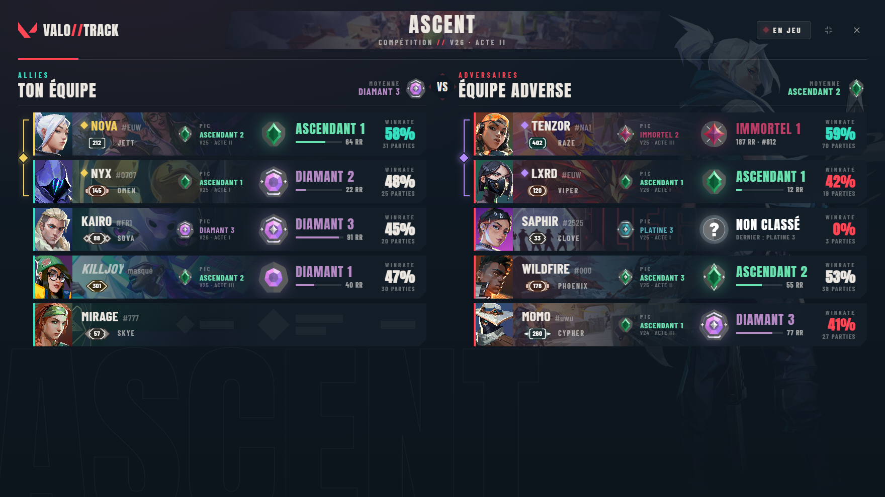
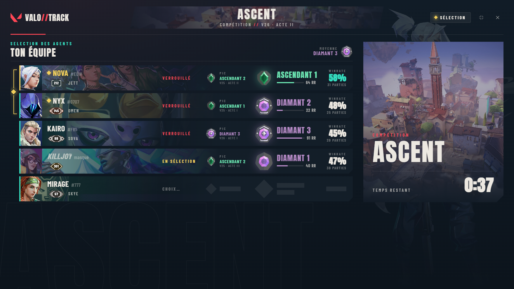
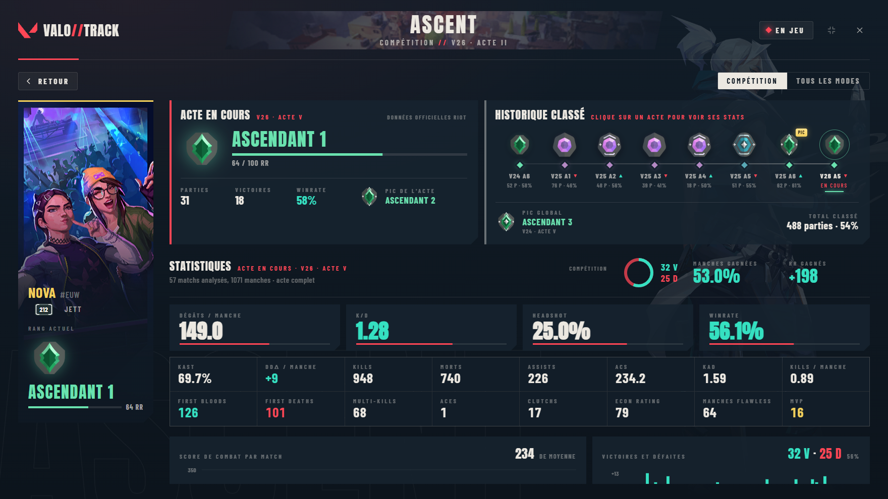
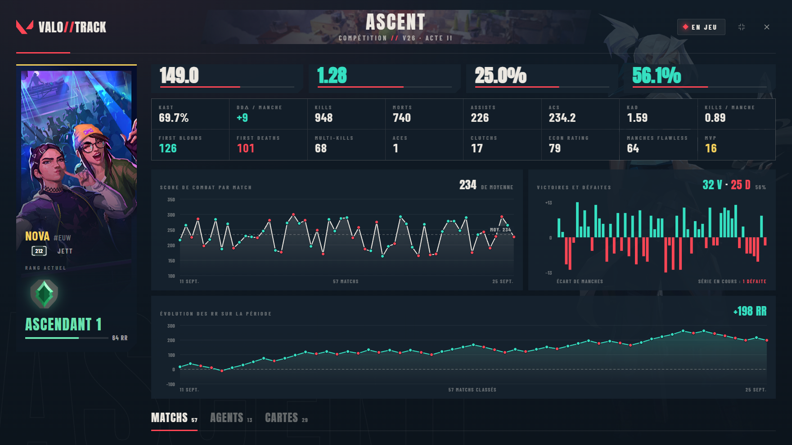
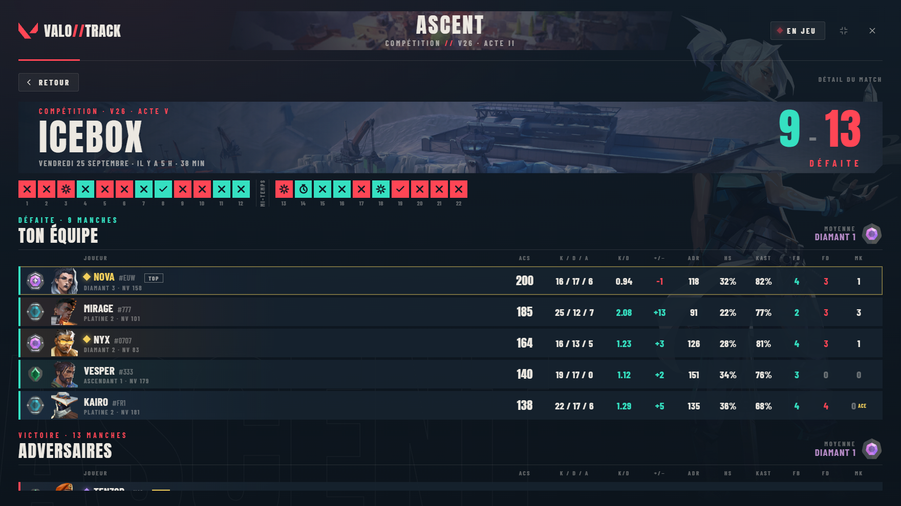

<h1 align="center">VALO//TRACK</h1>

Un overlay pour Valorant qui te montre, en pleine partie, le rang et les stats de tous les joueurs. 
Tu appuies sur <b>Alt+Z</b>, ça s'ouvre par-dessus le jeu. Tu rappuies, ça disparaît.

  <a href="../../releases/latest"><b>⬇ Télécharger pour Windows</b></a>

## Pourquoi

J'en avais marre d'alt-tab sur un tracker pendant la sélection d'agents pour savoir contre qui je jouais. Du coup j'ai fait un truc qui affiche tout directement au-dessus du jeu : le rang de chacun, son pic, son winrate de l'acte, son niveau, et qui joue en groupe avec qui (les crochets à gauche des joueurs).

## En partie et pendant la sélection

Dès la sélection des agents, tu vois ton équipe avec les rangs et le temps qu'il reste. Une fois en jeu, les deux équipes s'affichent côte à côte avec la moyenne de rang de chaque côté.

## La carrière d'un joueur

Tu cliques sur n'importe quel joueur et tu tombes sur sa carrière : son rang actuel, tous ses actes passés (clique sur un acte pour voir ses stats de l'époque), et ses stats sur tout l'acte en cours. K/D, ACS, dégâts par manche, headshot, KAST, first bloods, clutchs, aces, MVP… Ça marche aussi sur toi.

Plus bas, il y a l'évolution de son score de combat match par match, ses victoires et défaites, ses RR gagnés sur la période, et le détail par agent et par carte.

## Le détail d'un match

Un clic sur un match de la liste et tu as tout : le score, chaque manche (élimination, spike posé ou désamorcé, temps écoulé) et les 10 joueurs avec leurs stats. Tu peux encore cliquer sur un joueur de ce match pour voir sa carrière.

## Installer

1. Va dans les [releases](../../releases/latest) et télécharge `ValoOverlay-x.y.z-setup.exe`.
2. Lance-le. Pas besoin d'être administrateur.
3. Windows va sûrement afficher « Windows a protégé votre ordinateur », parce que l'installeur n'est pas signé (un certificat coûte cher). Clique sur **Informations complémentaires**, puis **Exécuter quand même**.

L'overlay se range ensuite dans la zone de notification, à côté de l'horloge (le V rouge). Clic gauche pour l'afficher, clic droit pour le quitter.

## Quelques trucs à savoir

- Valorant doit être en **plein écran fenêtré**, sinon rien ne peut s'afficher par-dessus le jeu.
- Alt+Z, c'est aussi le raccourci de l'overlay NVIDIA. Si les deux s'ouvrent en même temps, change le tien dans `%APPDATA%\fr.valooverlay.app\config.json` (ligne `hotkey`, par exemple `"F10"`).
- La fenêtre se redimensionne toute seule selon ta résolution (4:3 compris). Tu peux aussi la réduire avec le bouton à côté de la croix, ou en tirant sur les bords.
- Tout passe par ton client Riot, avec ta propre session. Rien n'est installé dans le jeu et aucun fichier du jeu n'est touché.
- Les joueurs en mode incognito restent masqués.
- Quand il est fermé, l'overlay ne fait rien et ne prend pas de FPS.

Un bug, une idée ? Ouvre une [issue](../../issues).

---

VALO//TRACK n'est ni approuvé ni sponsorisé par Riot Games et ne reflète pas l'opinion de Riot Games ni de quiconque ayant participé à la production ou à la gestion de ses propriétés. Riot Games et toutes les propriétés associées sont des marques commerciales ou déposées de Riot Games, Inc. Les visuels du jeu viennent de valorant-api.com. Les captures utilisent des pseudos fictifs.
